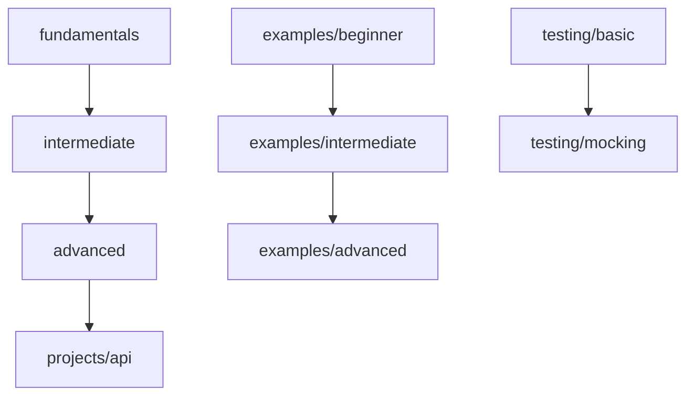

# Project Structure & Organization

Understanding the architectural decisions behind the Go Laboratory repository organization.

## Overview

This document explains the rationale behind the project's structure and how different components relate to each other.

## Directory Structure

```
go-lab/
├── docs/                    # Documentation and guides
│   ├── tutorials/           # Step-by-step learning guides
│   ├── architecture/        # Design decisions and patterns
│   └── api-reference/       # Generated API documentation
├── learning/                # Structured learning path
│   ├── fundamentals/        # Basic Go concepts
│   ├── intermediate/        # OOP and composition
│   └── advanced/           # Concurrency and patterns
├── examples/               # Practical, real-world examples
│   ├── beginner/           # Entry-level examples
│   ├── intermediate/       # More complex examples
│   └── advanced/           # Production-like examples
├── testing/                # Testing strategies and examples
│   ├── mocking/            # Mock generation and usage
│   └── test/               # Various testing patterns
├── projects/               # Complete application examples
│   └── api/                # Production-ready API
├── templates/              # Project scaffolding
└── scripts/                # Utility scripts
```

## Design Principles

### 1. Progressive Learning Path

The structure supports learning progression from basic to advanced concepts:



### 2. Separation of Concerns

Each directory has a specific purpose:

- **`learning/`**: Educational content with clear prerequisites
- **`examples/`**: Practical applications of concepts
- **`testing/`**: Testing strategies and patterns
- **`projects/`**: Complete, production-ready applications
- **`docs/`**: Comprehensive documentation

### 3. Discoverability

- Clear naming conventions
- README files in every directory
- Cross-references between related content
- Skill-level indicators

## Architectural Patterns Demonstrated

### Clean Architecture (Hexagonal)

Demonstrated in [`/projects/api/`](../../projects/api/):

```
internal/
├── application/        # Use cases and business logic
├── domain/            # Core business entities
└── infrastructure/    # External concerns
    ├── adapters/      # Interface adapters
    └── repository/    # Data persistence
```

### Dependency Injection

Examples throughout the repository show:
- Constructor injection
- Interface-based design
- Inversion of control
- Testable architectures

### Design Patterns

Organized by category in [`/learning/advanced/patterns/`](../../learning/advanced/patterns/):

- **Creational**: Builder, Prototype, Singleton
- **Structural**: Adapter, Decorator (through embedding)
- **Behavioral**: Strategy (through interfaces), Observer

## Testing Architecture

### Testing Pyramid

```
                    /\
                   /  \
              E2E /    \
                 /      \
            Integration  \
               /          \
              /   Unit     \
             /______________\
```

Implemented across:
- **Unit Tests**: In each package alongside code
- **Integration Tests**: In `/testing/` directory
- **E2E Tests**: In `/projects/api/integration_test.go`

### Testing Strategies

1. **Standard Library**: Basic testing with `testing` package
2. **BDD**: Ginkgo/Gomega for behavior-driven development
3. **Mocking**: uber-go/mock for dependency isolation
4. **HTTP Testing**: `httptest` for service testing

## Module Organization

### Go Modules Structure

Each major component can be a separate module:
- Root module for shared utilities
- Potential separate modules for large projects
- Clear module boundaries and dependencies

### Package Naming

Following Go conventions:
- Short, descriptive names
- No underscores or mixed caps
- Package name matches directory name
- Domain-focused organization

## Scalability Considerations

### Adding New Content

When adding new examples or learning materials:

1. **Determine Skill Level**: Place in appropriate directory
2. **Add Documentation**: Include comprehensive README
3. **Cross-Reference**: Link to related content
4. **Update Indexes**: Maintain navigation aids

### Maintaining Structure

- Regular review of organization effectiveness
- Refactoring when categories become too large
- Maintaining consistent documentation standards
- Keeping cross-references up to date

## Evolution Strategy

### Phase 1: Learning Path ✅
- Organized foundational learning materials
- Clear progression from basic to advanced
- Comprehensive documentation

### Phase 2: Consolidation ✅
- Merged similar examples
- Unified testing approaches
- Improved discoverability

### Phase 3: Enhancement (Current) 🚧
- Added comprehensive documentation
- Created project templates
- Enhanced cross-referencing

### Phase 4: Advanced Features (Future)
- Interactive tutorials
- Automated code generation
- Performance benchmarking
- CI/CD examples

## Best Practices Encoded

### File Organization
- Related files grouped together
- Clear separation of concerns
- Consistent naming conventions

### Documentation Strategy
- README in every directory
- Progressive disclosure of complexity
- Practical examples with explanations

### Code Organization
- Interface-driven design
- Dependency injection patterns
- Testable architectures
- Production-ready practices

## Decision Records

### Why This Structure?

1. **Educational Focus**: Primary goal is teaching Go effectively
2. **Progressive Complexity**: Natural learning progression
3. **Practical Application**: Real-world examples and patterns
4. **Discoverability**: Easy to find relevant content
5. **Maintainability**: Clear separation makes updates easier

### Alternative Approaches Considered

1. **Single examples/ directory**: Too flat, hard to navigate
2. **Technology-based grouping**: Less intuitive for learning
3. **Feature-based organization**: Doesn't support skill progression
4. **Library-style structure**: Too academic, less practical

### Trade-offs Made

- **Depth vs. Breadth**: Focused on essential patterns
- **Completeness vs. Clarity**: Clear examples over comprehensive coverage
- **Academic vs. Practical**: Practical examples with theoretical grounding
- **Simplicity vs. Features**: Simple structure that's easy to navigate

This structure evolves based on user feedback and learning effectiveness. The goal is always to provide the clearest path to Go mastery.